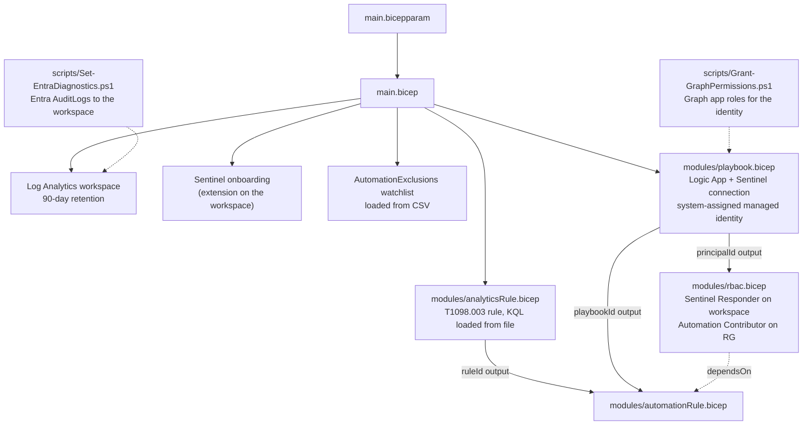
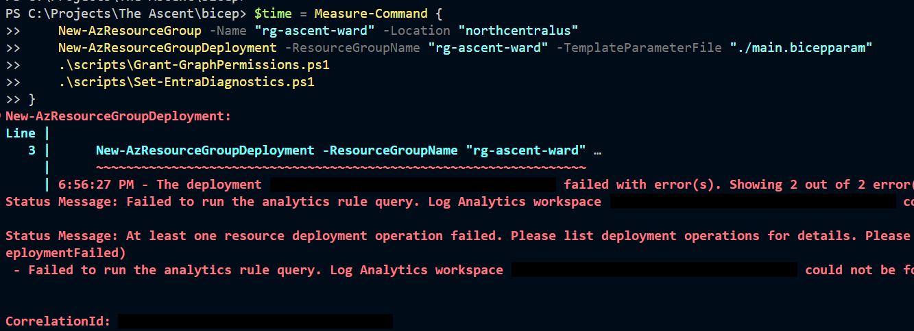
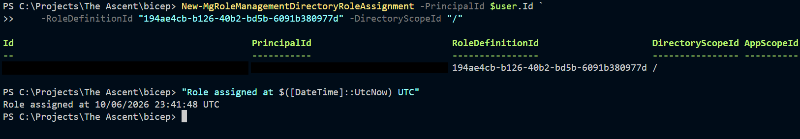

# The Ascent: The Ward, Rebuilt in Bicep

[The Ward](https://github.com/Lglass510/The_Ward_Sentinel_Soar) is a Microsoft Sentinel lab that detects privilege escalation in Entra ID (MITRE ATT&CK [T1098.003](https://attack.mitre.org/techniques/T1098/003/)) and disables the targeted account with a Logic App playbook. I built it by hand in the Azure portal. The Ascent rebuilds the whole thing as code, so it can be deleted and brought back with one deployment and two scripts.

**The short version:** I deleted the resource group and rebuilt it from this repo. The first attempt failed on Sentinel state that outlived the deleted workspace. I traced it, changed one line in the parameters file, and the full deployment then finished in 1 minute 9 seconds with no portal clicks.

| Result | Evidence |
|---|---|
| Rebuild from an empty resource group: **1 deployment + 2 scripts** | [`main.bicepparam`](bicep/main.bicepparam), [`scripts/`](bicep/scripts/) |
| Deployment time after the fix: **1 min 9 s** | Deployment history, 2026-10-06 23:24–23:25 UTC |
| Resources defined in Bicep: **9** | Workspace, Sentinel, watchlist, analytics rule, API connection, playbook, 2 role assignments, automation rule |
| Manual portal steps: **0** | Everything else is in the two scripts |
| Scripts safe to re-run: **yes** | Second run of each script changed nothing ([screenshot](bicep/screenshots/script_ran_twice.png)) |
| End-to-end attack test: **pending** | Waiting on Entra log routing to the new workspace (see [What went wrong](#what-went-wrong)) |

## Architecture



### What lives where

| Layer | Built by | Why there |
|---|---|---|
| Workspace, Sentinel, watchlist | `main.bicep` | Resource group scope |
| Analytics rule, playbook, RBAC, automation rule | Bicep modules | One module per component; IDs passed between them as outputs |
| Graph app roles (`User.EnableDisableAccount.All`, `User.Read.All`) | `Grant-GraphPermissions.ps1` | Entra ID, outside any resource group |
| Entra `AuditLogs` routing to the workspace | `Set-EntraDiagnostics.ps1` | Tenant-level diagnostic setting, outside any resource group |
| `SecurityInsights` solution, the Fusion rule, Defender's role assignments | Azure, automatically | Created by the platform when Sentinel is turned on. Not in my code, and not meant to be. |

## Deploy it

Prerequisites: Az PowerShell, Microsoft Graph PowerShell, Owner on the subscription, and an Entra role that can grant app roles and set diagnostic settings (Global Administrator in my lab).

```powershell
cd bicep

# 1. Add your own protected accounts
Copy-Item data/AutomationExclusions.sample.csv data/AutomationExclusions.local.csv
# edit the .local.csv; it is git-ignored

# 2. Set your tenant's Sentinel service principal ID in main.bicepparam
(Get-AzADServicePrincipal -DisplayName "Azure Security Insights").Id

# 3. Deploy
New-AzResourceGroup -Name "rg-ascent-ward" -Location "northcentralus"
New-AzResourceGroupDeployment -ResourceGroupName "rg-ascent-ward" -TemplateParameterFile "./main.bicepparam"
.\scripts\Grant-GraphPermissions.ps1
.\scripts\Set-EntraDiagnostics.ps1
```

Allow up to three days before Entra audit logs start arriving in a new workspace. See below.

## Design decisions

**Rule and assignment names come from `guid()`.** `guid(law.id, 'T1098.003')` returns the same value every deployment, so redeploying updates the rule instead of creating a duplicate.

**Modules look the workspace up with `existing`.** A module can't see `main.bicep`'s symbolic names, so it takes the workspace name as a parameter and declares the workspace with `existing`. Nothing gets rebuilt.

**`dependsOn` appears three times, only where nothing else forces the order.** Bicep orders resources by their references. The watchlist and analytics rule need Sentinel turned on, and the automation rule needs Sentinel's permission to run the playbook, but none of them reference those resources, so the dependency is written out.

**The playbook's watchlist lookup takes the workspace as a parameter.** The workflow exported from The Ward had The Ward's workspace hardcoded in the `Get_Protected_Accounts` URI. Deployed as-is, the new playbook would have checked the old workspace's exclusion list, and once The Ward was deleted the check would have failed silently. The URI now uses `@{parameters('workspaceId')}`, filled from `law.id` at deploy time.

**Role assignments set `principalType: 'ServicePrincipal'`.** A new managed identity can take time to replicate in Entra. Declaring the type skips the lookup that causes intermittent `PrincipalNotFound` errors.

**The Responder assignment's name includes the identity's principal ID.** This makes What-If report it as "Unsupported" because the ID only exists once deployment starts. A name without it would avoid the warning, but if the playbook were ever rebuilt with a new identity, Azure would refuse to repoint the old assignment. I kept the warning.

**Only `AuditLogs` is routed from Entra.** The Ward's connector sends 14 categories. The detection reads one table, so this sends one.

**Graph permissions use a script, not the Graph Bicep extension.** The extension can declare app role assignments, but it adds setup and needs Graph permissions for whoever deploys. Moving the grant into Bicep is the next improvement.

**Added MITRE mapping.** The Ward's rule had no tactics or techniques. This one maps to Persistence and PrivilegeEscalation, T1098, T1098.003.

**Two Bicep warnings are suppressed on purpose.** Bicep's type data for `Microsoft.Web/connections` doesn't know `kind` or `parameterValueType`. I confirmed both against The Ward's live connection, where they are what makes the connection use the managed identity, then marked them with `#disable-next-line`.

## What went wrong

**1. The rebuilt workspace had no data source.** Turning on Sentinel doesn't bring in Entra logs. In The Ward, the portal's Entra ID data connector had quietly created a tenant-level diagnostic setting. The rebuild had nothing equivalent, so the rule would have run every 15 minutes against an empty table. `Set-EntraDiagnostics.ps1` fills the gap.

**2. Graph sign-in landed in the wrong tenant.** `Connect-MgGraph` without `-TenantId` signed my personal Microsoft account into its own home tenant, which has no directory, and every Graph call returned `This API is not supported for MSA accounts`. The script now reads the tenant from the current Az session.

**3. The first rebuild failed on a deleted workspace's ID.** I force-deleted the workspace so it wouldn't come back from soft delete, then redeployed under the same name. Six of eight resources deployed. The analytics rule failed with `Log Analytics workspace '364ce05e-…' could not be found`, while the new workspace's ID was `873289fe-…`. Sentinel still had the old workspace's rules filed under that resource ID, with last-modified times from before the teardown. Waiting 25 minutes didn't clear it.



The fix was one line in `main.bicepparam` (`lawName = 'law-ascent-ward2'`). Everything already deployed came back as no change, and the full deployment succeeded. The lesson for teardown: remove Sentinel from a workspace before deleting it, or don't reuse the name.

**4. The attack test found the pipeline still cold.** I assigned Security Administrator to a test account at 23:41:48 UTC. The Ward's workspace logged it. The new workspace received nothing, 13 hours later. The two diagnostic settings are identical apart from their age. Microsoft's [Entra log latency reference](https://learn.microsoft.com/entra/identity/monitoring-health/reference-log-latency) says a new route to a Log Analytics workspace can take up to three days to start. I removed the role and will rerun the test once logs arrive. A detection is only as current as the data feeding it, and the check for that should run before the attack, not after.



## Reading What-If

A redeploy with no code changes still shows a few lines. None of them are real changes:

| What-If line | Cause |
|---|---|
| `~ Modify` on the watchlist | Azure adds fields on create (`watchlistId`, `created`) and never returns write-only ones (`rawContent`), so the template and the live resource can't match exactly |
| `x Unsupported` on a role assignment | Its name uses the managed identity's ID, which What-If can't know before deployment |
| `x NoEffect` on `principalType` | Write-only property, not returned when read |
| `* Ignore` on the `SecurityInsights` solution | Created by Azure, not in the template |

## End-to-end test

Pending. Plan: disable The Ward's automation rule so only The Ascent responds, assign Security Administrator to a test account that isn't on the watchlist, then confirm each link: `AuditLogs` row, incident, playbook run, account disabled with an incident comment.

| Time (UTC) | Event |
|---|---|
| | Role assigned |
| | `AuditLogs` row ingested |
| | Incident created |
| | Playbook run |
| | Account disabled, comment posted |

## Skills used

- **Bicep:** modules, outputs, `existing`, extension resources with `scope`, `loadTextContent` / `loadJsonContent`, `.bicepparam`, `guid()` for idempotent names
- **ARM deployments:** What-If, deployment history and operations, incremental mode
- **Microsoft Sentinel:** onboarding state, scheduled analytics rules, automation rules, watchlists
- **Logic Apps:** workflow definition parameters, Sentinel API connection with managed identity
- **Azure RBAC:** role assignments scoped to a workspace and to a resource group
- **Microsoft Graph and Entra ID:** app role assignments for a managed identity, tenant diagnostic settings
- **PowerShell:** Az and Graph modules, `Invoke-AzRestMethod` for APIs without cmdlets, idempotent scripts

## Repository layout

| Path | Contents |
|---|---|
| [`bicep/main.bicep`](bicep/main.bicep) | Workspace, Sentinel, watchlist, module calls |
| [`bicep/main.bicepparam`](bicep/main.bicepparam) | Parameter values for one-command deploys |
| [`bicep/modules/`](bicep/modules/) | Analytics rule, playbook, RBAC, automation rule |
| [`bicep/detection/`](bicep/detection/) | T1098.003 KQL query |
| [`bicep/playbook/workflow.json`](bicep/playbook/workflow.json) | Logic App workflow, exported from The Ward and parameterized |
| [`bicep/data/`](bicep/data/) | Watchlist sample (real `.local.csv` is git-ignored) |
| [`bicep/scripts/`](bicep/scripts/) | Graph permissions and Entra log routing |
| [`bicep/screenshots/`](bicep/screenshots/) | Evidence |

I built this with Claude Code as a tutor: it explained concepts, gave me skeletons to fill in, and reviewed my code. I wrote the Bicep modules and scripts and ran the deployments. Claude also made some edits directly: cleanup of the Graph script, the final workspace rename and redeploy, sanitizing the tenant data, and a first draft of this README.
